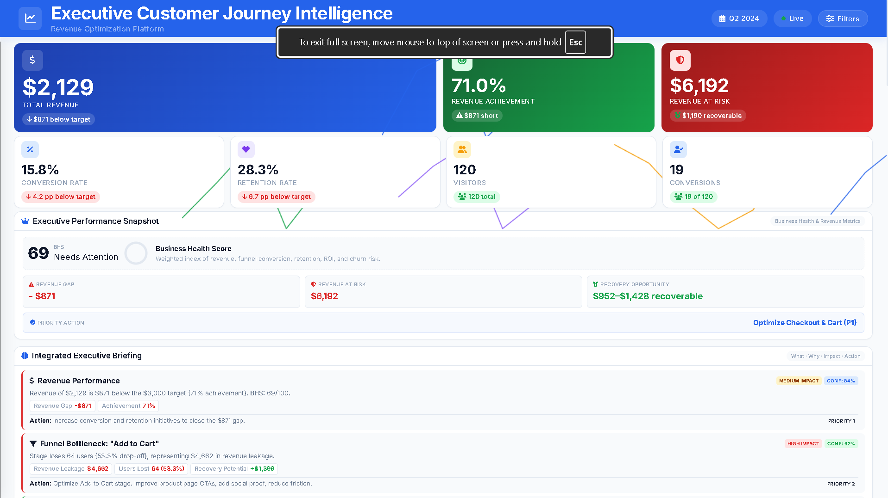

# Customer Journey & Funnel Analysis Dashboard

📅 **Analysis Period:** Jan 2024 – Jun 2024

👥 **Customer Records Analyzed:** 120

💻 **Interactive Dashboard:** [Live Dashboard (GitHub Pages)](https://girishshenoy16.github.io/customer-journey-funnel-analysis-dashboard)

📂 **Executive Deliverable:** [Strategic Business Recommendations Report](https://girishshenoy16.github.io/customer-journey-funnel-analysis-dashboard/preview_report.html)


---



---

> [!IMPORTANT]
> **FY2026 Executive Revenue Growth Directives**
>
> 1. Eliminate the Add-to-Cart bottleneck responsible for **75% of total revenue leakage**.
> 2. Recover approximately **$1,190 in immediately identifiable revenue opportunities**.
> 3. Increase overall conversion rate from **15.8% to 20–22%** through funnel optimization initiatives.
> 4. Scale high-performing Referral and Premium customer segments to accelerate revenue growth.
> 5. Reduce churn exposure through retention and customer recovery programs.

---


## 📊 Executive Summary

An end-to-end Customer Journey & Funnel Analysis Dashboard that tracks 120 customers across 5 funnel stages, 6 channels, 3 segments, and 8 campaigns
to identify exactly where customers drop off, which channels perform best, which segments are most valuable, and how to improve conversion and retention.

**Key Findings:**
 - **15.8%** conversion rate — 19 of 120 visitors purchased
 - **🔴 53.3% drop-off** at View → Cart (critical revenue leak)
 - **🔴 51.3% drop-off** at Checkout → Purchase (critical revenue leak)
 - **🟢 Referral channel** converts at 30% (3× better than average)
 - **🟢 Premium segment** converts at 33.3% (9× better than Budget)

> **Expected Impact:** 9 recommendations projected to improve conversion from 15.8% → **20–22%** (+30–40% lift)

---

## 🎯 Objective

The objective of this project is to build an executive-grade Customer Journey Intelligence and Revenue Optimization platform that enables leadership teams to monitor customer acquisition performance, identify funnel bottlenecks, measure revenue leakage, evaluate retention risks, and prioritize revenue recovery initiatives.

The solution simulates the customer analytics environments used by Growth Teams, Product Managers, Revenue Operations, CRM Teams, and Executive Leadership to drive conversion improvements and customer lifetime value growth through data-driven decision-making.

---

## ❓ Business Problem

Organizations invest heavily in marketing, acquisition, and customer engagement initiatives but frequently struggle to understand where customers abandon the buying journey.

Without structured funnel analytics:

* Revenue leakage remains hidden.
* High-value acquisition channels are underutilized.
* Conversion bottlenecks persist without visibility.
* Customer retention initiatives become reactive instead of proactive.
* Leadership teams lack actionable revenue recovery intelligence.

Stakeholders require:

1. Complete customer journey visibility.
2. Funnel bottleneck identification.
3. Revenue leakage measurement.
4. Customer retention intelligence.
5. Executive-level recovery recommendations.

---

## 🏢 Industry Usage

This project is directly applicable to the following business functions:

| Industry / Role | How It's Used |
|----------------|---------------|
| **Marketing** | Campaign ROI analysis, channel optimization, lead quality assessment |
| **Product Management** | Feature impact on funnel, UX improvement prioritization |
| **Sales** | Lead scoring, conversion bottleneck identification |
| **Growth Teams** | Experiment prioritization, funnel optimization |
| **CRM** | Customer retention programs, churn reduction |
| **Executive / Management** | KPI monitoring, data-driven strategy decisions |

---

## 💡 Why This Project Matters

Every company wants to improve:

- **Leads** — More prospects entering the funnel
- **Conversion Rates** — More prospects becoming customers
- **Revenue** — Higher average order value and total sales
- **Retention** — Customers who stay and buy again

This project provides a **repeatable framework** for tracking and improving all four metrics.

---

## 📦 Business Value Delivered

The dashboard identified the following executive-level business opportunities:

| Business Outcome             | Value  |
| ---------------------------- | ------ |
| Revenue Generated            | $2,129 |
| Revenue Target Gap           | -$871  |
| Revenue At Risk              | $6,192 |
| Revenue Recovery Opportunity | $1,190 |
| Funnel Health Score          | 31/100 |
| Business Health Score        | 69/100 |
| Conversion Rate              | 15.8%  |
| Customer Retention Rate      | 28.3%  |

The platform enables decision-makers to prioritize the highest-impact initiatives, reduce funnel leakage, improve customer retention, and maximize revenue performance.

---

## 🔄 Funnel Framework

### The 5-Stage Customer Journey

```
┌─────────────┐     ┌─────────────┐     ┌─────────────┐     ┌─────────────┐     ┌─────────────┐
│  Website    │ ──▶ │  Product    │ ──▶ │  Add to     │ ──▶ │  Checkout   │ ──▶ │  Purchase   │
│  Visit      │     │  Viewed     │     │  Cart       │     │  Started    │     │  Completed  │
│  (120)      │     │  (120)      │     │  (56)       │     │  (39)       │     │  (19)       │
└─────────────┘     └─────────────┘     └─────────────┘     └─────────────┘     └─────────────┘
      100%               100%              46.7%              32.5%               15.8%
```

### Stage Transition Analysis

| Transition          | Lost | Drop-off % | Status      |
|---------------------|------|------------|-------------|
| Visit → View        | 0    | 0.0%       | ✅           |
| View → Cart         | 64   | **53.3%**  | 🔴 Critical |
| Cart → Checkout     | 17   | 30.4%      | 🟡 Warning  |
| Checkout → Purchase | 20   | **51.3%**  | 🔴 Critical |

**Overall Conversion Rate: 15.8%** (19 of 120 visitors purchased)

---

## 🔬 Analysis Performed

### 1. Business Problem Definition
- Identified low conversion and retention as primary business challenges
- Defined scope: 5-stage funnel, 6 channels, 3 segments, 8 campaigns

### 2. Customer Journey Mapping
- Mapped complete customer journey from awareness to retention
- Defined 5 funnel stages with clear entry/exit criteria

### 3. Data Collection & Generation
- Generated 120 realistic customer records with 20 attributes
- Simulated real-world behavior patterns across segments and channels

### 4. Data Cleaning
- Handled missing values (feedback scores)
- Standardized data types and formats
- Created derived columns (Visit Month, Visit Day)
- Validated data integrity and consistency

### 5. Exploratory Data Analysis (EDA)
- Summary statistics for all numeric columns
- Distribution analysis for categorical variables
- Correlation heatmap between journey metrics
- Segment, channel, and regional distribution analysis

### 6. Funnel Analysis
- Stage-by-stage conversion tracking
- Drop-off rate calculation for each transition
- Critical bottleneck identification (>30% = warning, >50% = critical)

### 7. Customer Segmentation
- By segment: Premium (33.3% conv), Standard (10.5%), Budget (3.7%)
- By region: West (25.8%), East (20.8%), South (12.5%), North (12.0%), Central (0.0%)
- By age: 55+ (25.0%), 18-24 (18.8%), 35-44 (18.5%), 25-34 (16.4%), 45-54 (5.6%)

### 8. Channel & Campaign Analysis
- Channel ranking by conversion rate: Referral (30%) > Direct (20%) > Paid Ads (14.3%)
- Campaign ranking: Summer Sale (25%) > New User Offer (20%) > Winter Fest (18.8%)
- CAC and ROAS estimation for each channel
- Campaign revenue and retention analysis

### 9. Retention Analysis
- Overall retention rate: 28.3%
- Premium segment retention: 47.2% (best)
- Budget segment retention: 18.5% (needs improvement)
- Churned: 58 customers, At Risk: 28 customers

### 10. Dashboard Development
- Built PowerBI-style interactive web dashboard
- 5 KPI cards, 6 charts, retention insights, recommendations panel
- Real-time filtering by region, segment, channel, age, campaign

### 11. Insight Generation
- Identified 10 key insights across funnel, segments, channels, and retention
- Categorized by severity (critical, warning, opportunity)

### 12. Recommendation Preparation
- 9 actionable recommendations with timelines, owners, and impact estimates
- A/B testing roadmap for validation
- KPI targets for next quarter

---

## 📐 Key Metrics (KPIs)

The platform tracks business-critical metrics commonly used by Product, Growth, Marketing, Revenue Operations, and Executive Leadership teams.

| KPI                           | Purpose                                      |
| ----------------------------- | -------------------------------------------- |
| Revenue Achievement           | Progress toward business targets             |
| Revenue Gap                   | Difference between actual revenue and target |
| Revenue at Risk               | Revenue vulnerable to customer drop-off      |
| Revenue Recovery Opportunity  | Recoverable revenue through optimization     |
| Conversion Rate               | Visitor-to-customer conversion efficiency    |
| Retention Rate                | Customer loyalty and repeat engagement       |
| Churn Risk                    | Customer attrition exposure                  |
| Customer Lifetime Value (CLV) | Long-term customer value                     |
| Revenue Per Visitor (RPV)     | Revenue efficiency metric                    |
| Average Order Value (AOV)     | Transaction performance indicator            |
| Funnel Health Score           | Overall journey effectiveness                |
| Business Health Score         | Executive business performance indicator     |

---

# 🔬 Executive Insights

### Revenue Leakage Concentration

The Add-to-Cart stage contributes approximately 75% of total revenue leakage, representing the single largest opportunity for immediate business improvement.

### Referral Channel Opportunity

Referral traffic converts at approximately 30%, nearly double the overall channel average, indicating strong scaling potential.

### Premium Customer Advantage

Premium customers generate the highest conversion and retention rates, making them the most valuable segment for expansion initiatives.

### Regional Revenue Dependency

The West region contributes more than half of total revenue, creating concentration risk and highlighting the need for regional diversification.

### Customer Retention Challenge

More than two-thirds of customers exhibit churn or disengagement characteristics, creating significant future revenue exposure.

---

## 🖥️ Dashboard Features

The refined **Executive Customer Journey Intelligence & Revenue Optimization Platform** dashboard includes the following layouts and features:

### 1. Primary & Secondary KPI Row
* **Primary Metrics**: Total Revenue ($2,129.48), Revenue Achievement (71% of $3,000 target), and Revenue at Risk ($2,871 lost at funnel stages).
* **Secondary Metrics**: Conversion Rate (15.8%), Retention Rate (28.3%), Total Visitors (120), and Total Conversions (19).
* **Sparklines**: Mini-trend sparkline overlays on core metrics.

### 2. Executive Intelligence Command Center (Consolidated)
* **Executive Performance Snapshot**: A side-by-side snapshot card featuring the **Business Health Score (BHS)** gauge and breakdown (based on revenue, conversion, retention, ROI, and churn risk), combined with real-time trackers for target achievement gaps (-$871), revenue at risk ($2,871), recovery opportunity ($718–$861), and priority action.
* **Integrated Executive Briefing**: Dynamic panel summarizing critical insights (What, Why, Impact, and recommended Action) placed side-by-side with the performance snapshot above the first fold to improve scanning speed and reduce vertical space.
* **Risk & Opportunity Matrix**: Prioritized risk logs evaluating severity, urgency, and revenue loss values.
* **Revenue Waterfall & Recommendation Summaries**: Visual step-down of leaking revenue and immediate next steps.

### 4. Revenue Leakage & Recovery Intelligence
* **Interactive Funnel**: Interactive horizontal funnel chart showing stage counts (Visit 120 → View 120 → Cart 56 → Checkout 39 → Purchase 19).
* **Recovery Breakdown**: Dedicated cards summarizing the largest leakage point, a stage conversion table, and a projected revenue recovery roadmap.

### 5. Revenue Growth & Customer Intelligence
* **Channel Performance Widget**: Tracks channel volume, conversion rates, and revenue with recommended channel-specific actions.
* **Regional Performance Widget**: Lists regional revenue contributions, conversion rates, and localized risk profiles.
* **Customer Health & Segment Intelligence**: Evaluates customer risk profiles (Healthy vs Churned), segment CLV metrics, and a dynamic customer segment opportunity matrix (Invest vs Optimize categories).

### 6. Executive Action Roadmap
* Timed initiatives split by **Immediate Actions** (0–2 Weeks), **Near-Term Actions** (2–4 Weeks), and **Strategic Initiatives** (1–2 Months).
* **Visual Polish Refinements**: High-density spacing (~12% vertical height reduction), larger priority badges, and color-highlighted KPI chips (Revenue Impact, Timeline, Owner) for instant scannability during leadership presentations.

### 7. Sidebar Filters & Footer Branding
* Multi-select dropdown menus for Region, Segment, Channel, Age Group, and Campaign with a global reset action.
* **Refined Footer**: Features the platform title, preparer signature (*"Built by Girish Shenoy"*), portfolios metadata, and dataset information.

### Technical Features
- 🎯 Fullscreen mode for executive presentations
- 📱 Responsive design (desktop, tablet, mobile)
- 🎨 Charts auto-resize to container
- ⚡ Animated KPI counters on load
- 🔍 Tooltip drill-down on all chart elements
- 🎛️ Collapsible sidebar for maximum chart space

---

## 💎 Key Insights

| #  | Insight                                                 | Severity       |
|----|---------------------------------------------------------|----------------|
| 1  | **53.3% drop-off** at View → Cart stage                 | 🔴 Critical    |
| 2  | **51.3% drop-off** at Checkout → Purchase stage         | 🔴 Critical    |
| 3  | **Premium segment converts 9× better** than Budget      | 🟢 Opportunity |
| 4  | **Referral channel** has highest conversion (30%)       | 🟢 Opportunity |
| 5  | **Central region** has 0% conversion                    | 🔴 Critical    |
| 6  | **Social Media** underperforms (10.5% conversion)       | 🟡 Warning     |
| 7  | **Budget segment** retention at 18.5%                   | 🟡 Warning     |
| 8  | **Summer Sale** campaign converts at 25%                | 🟢 Opportunity |
| 9  | **58 customers churned** (48.3% of total)               | 🔴 Critical    |
| 10 | **Email channel** retains best (33.3%) but converts low | 🟡 Warning     |

---

## Recommendations

> **For Executive Action:** The following 9 recommendations are prioritized by impact. Items marked 🔴 High should be initiated in Week 1. Detailed action plans with owners and timelines are in the [full recommendations report](reports/Business_Recommendations_Report.md).

| #  | Action Required                                                                                  | Impact | Timeline  |
|----|--------------------------------------------------------------------------------------------------|--------|-----------|
| 🔴 | **1. Fix Cart Abandonment** — Exit popups, free shipping threshold, cart email sequence          | High   | Week 1–2  |
| 🔴 | **2. Fix Checkout Drop-off** — Simplify form (3-4 fields), guest checkout, trust badges          | High   | Week 1–3  |
| 🔴 | **3. Expand Premium Segment** — Lookalike audiences, loyalty program, exclusive offers           | High   | Week 1–4  |
| 🔴 | **4. Scale Referral Program** — Increase rewards, post-purchase referral CTA                     | High   | Week 1–2  |
| 🟡 | **5. Central Region Recovery** — Market research, localized campaigns, A/B test landing page     | Medium | Week 1–3  |
| 🟡 | **6. Replicate Summer Sale** — Document playbook, apply to Flash Sale campaign                   | Medium | Week 1–3  |
| 🔴 | **7. Retention Program** — Post-purchase emails, re-engagement for 28 at-risk customers, loyalty | High   | Month 1–2 |
| 🟡 | **8. Revise Social Strategy** — Shift to conversion-focused content, UTM tracking, promo codes   | Medium | Week 1–2  |
| 🟡 | **9. Revitalize Email** — Behavior-triggered flows, list segmentation, A/B subject lines         | Medium | Week 1–3  |


### Expected Business Outcome
| Metric          | Current | Projected        | Lift                               |
|-----------------|---------|------------------|------------------------------------|
| Conversion Rate | 15.8%   | **20–22%**       | **+30–40%**                        |
| Retention Rate  | 28.3%   | **35–40%**       | **+25–35%**                        |
| Revenue Impact  | $2,129  | **$3,500–4,500** | **+60–110%** (projected quarterly) |

---


## 📂 Project Structure

```
customer-journey-funnel-analysis-dashboard/
│
├── docs/                           ← GitHub Pages (dashboard)
│   ├── index.html                  ← PowerBI-style dashboard
│   ├── preview_report.html         ← Business recommendations report page
│   ├── business_recommendations_report.md         ← Business recommendations report 
│   ├── css/
│   │   └── style.css               ← Dashboard styling
│   └── js/
│       └── dashboard.js            ← Charts + interactivity
│
├── data/
│   ├── customer_journey_data.csv       ← Raw dataset (120 rows)
│   └── customer_journey_cleaned.csv    ← Processed dataset
│
├── scripts/                        ← Python analysis
│   ├── generate_dataset.py         ← Dataset generator
│   ├── 01_data_cleaning.py         ← Data cleaning
│   ├── 02_exploratory_analysis.py  ← EDA
│   ├── 03_funnel_analysis.py       ← Funnel analysis
│   ├── 04_segmentation_analysis.py ← Segmentation
│   ├── 05_channel_campaign_analysis.py ← Channel & campaign
│   └── 06_create_excel.py          ← Excel workbook
│
├── excel/
│   └── customer_journey_analysis.xlsx  ← Excel with 7 sheets
│
├── reports/
│   ├── Project_Report.md           ← Detailed project report
│   └── Business_Recommendations_Report.md ← Actionable recommendations
│
├── screenshots/
│   └── dashboard_preview.png       ← Dashboard image
│
├── docs/assets/                    ← Generated analysis outputs
│   ├── eda_overview.png
│   ├── correlation_heatmap.png
│   ├── funnel_analysis.png
│   ├── funnel_table.csv
│   ├── drop_off_table.csv
│   ├── segmentation_analysis.png
│   ├── channel_campaign_analysis.png
│   ├── channel_performance.csv
│   └── campaign_performance.csv
│
├── README.md
├── requirements.txt
└── .gitignore
```

---

## ⚙️ How to Run Locally

### Prerequisites
- Python 3.11+
- Git

### Setup

```powershell
# Clone the repository
git clone https://github.com/girishshenoy16/customer-journey-funnel-analysis-dashboard.git
cd customer-journey-funnel-analysis-dashboard

# Create virtual environment
python -m venv venv

# Activate (Windows)
.\venv\Scripts\activate

# Activate (Mac/Linux)
# source venv/bin/activate

# Upgrade pip and install dependencies
python -m pip install --upgrade pip
pip install -r requirements.txt

# Generate dataset
python scripts/generate_dataset.py

# Run analysis pipeline
python scripts/01_data_cleaning.py
python scripts/02_exploratory_analysis.py
python scripts/03_funnel_analysis.py
python scripts/04_segmentation_analysis.py
python scripts/05_channel_campaign_analysis.py

# Generate Excel report
python scripts/06_create_excel.py

# Run python server 
python -m http.server 8000

# Open dashboard
# Just open http://localhost:8000/docs/ in your browser!
```


### View Dashboard
Open `docs/index.html` directly in your browser — no server required.

---

---

## 🏁 Conclusion

The Executive Customer Journey Intelligence Platform demonstrates how customer analytics, funnel intelligence, and revenue recovery frameworks can be combined into a decision-support solution for leadership teams.

The analysis identified:

* Significant revenue leakage within the customer journey
* High-performing acquisition opportunities
* Customer retention risks
* Revenue recovery potential
* Strategic growth initiatives

The platform transforms raw customer data into actionable executive intelligence that supports revenue optimization and business growth.

---

# 🏁 Future Enhancements

### Planned Improvements

* Machine Learning Churn Prediction
* Revenue Forecasting Models
* Customer Lifetime Value Prediction
* Cohort Analysis
* Real-Time Data Integration
* Automated Executive Alerts
* Generative AI Recommendation Engine
* Scenario Planning Simulator
* Marketing Attribution Modeling
* Predictive Revenue Recovery Engine


---
